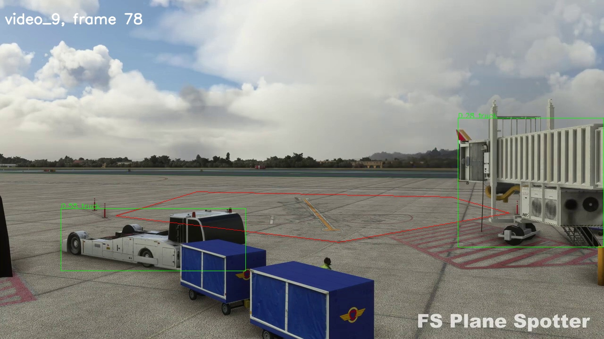
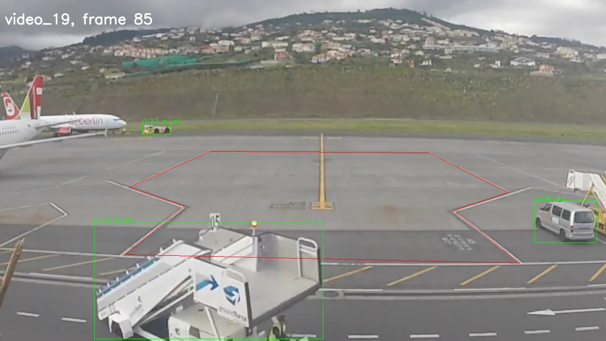
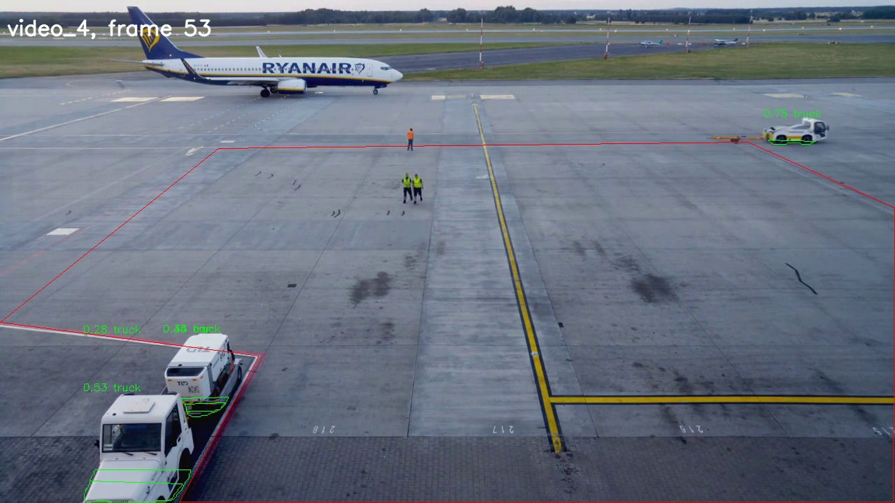
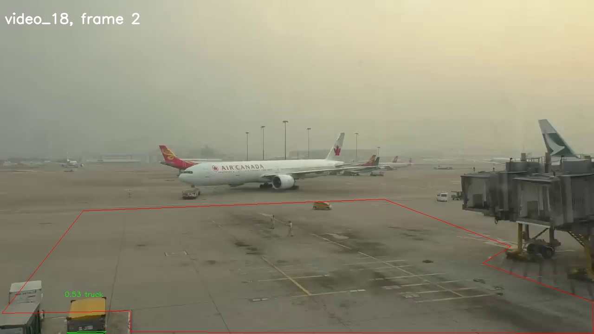
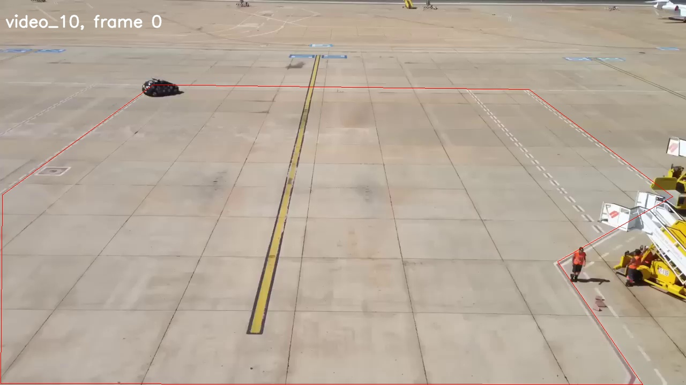
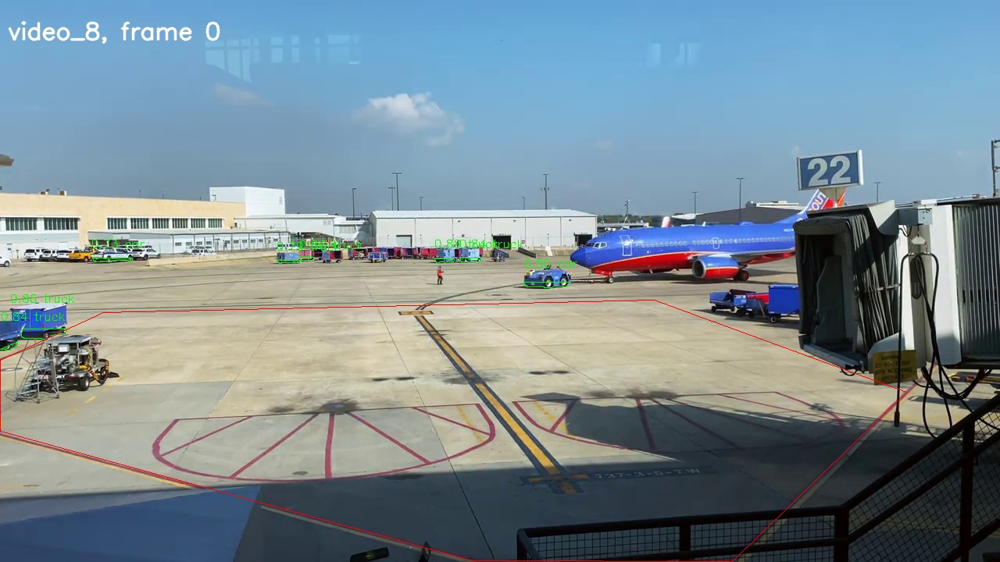

To test:
```
git clone git@github.com:boldyshev/aircraft-departure.git
cd aircraft-departure
bash entrypoint.sh <video_path> <polygon_path> <output_path>
```


To evaluate model time intervals converted to boolean masks:
If there is a video of 5 frames and the interval is `[2, 3]`,
the boolean mask is `[False, False, True, True, False]`. So this is a binary classification task.
* **F1**. Assuming that there is no information, which error, False Positive or False Negative is worse,
I consider F1 a well-suited metric. 
* **Jaccard Index** measures the overlapping of sets which suits for frame intervals.
Also calculated accuracy, precision and recall. 

The initial idea was to detect vehicles' bounding boxes and then search for intersections with the stand polygon.
It didn't work well as there were False Positive overlappings of the bboxes and the polygons.
<details close>
<summary>Images</summary>


</details>

Next I tried to use only the bottom lines of the bboxes, but there were also too many False Positives.
<details close>
<summary>Images</summary>

</details>

Then I decided to get segmentation mask contours and use only the bottom part of it.
<details close>
<summary>Images</summary>

</details>

YOLOv8 couldn't recognize some small cars
<details close>
<summary>Images</summary>


</details>

Tried heavier models but also started getting False Positives
<details close>
<summary>Images</summary>

</details>

| Model                                                                                     | F1     | Jaccard | Speed (s) | weights size MB | File                                            |
|-------------------------------------------------------------------------------------------|--------|---------|-----------|-----------------|-------------------------------------------------|  
| yolov8x_bbox                                                                              | 0.68   | 0.52    | 0.03      | 137             | [metrics](readme/metrics_yolo_bbox.json)        |
| yolov8x_bottom_line                                                                       | 0.72   | 0.56    | 0.02      | 137             | [metrics](readme/metrics_yolo_bottom_line.json) |
| yolov8x_segment                                                                           | 0.85   | 0.74    | 0.02      | 144             | [metrics](readme/metrics_yolo_segm.json)             |
| cascade-mask-rcnn_segment                                                                 | 0.82   | 0.69    | 0.16      | 430             | [metrics](readme/metrics_cascade.json)          |

YOLOv8 seems optimal but Cascade Mask R-CNN is actually more accurate, metrics are lower due to the inaccuracies in annotation file.
Though this comes at the computational expense. 


This solution doesn't work well on the boundary of the stand: vehicles of trailers that are parked by the border considered
inside the stand. The best improvement would be to collect custom dataset, preferrably with 3d bounding boxes
to be able to discover vehicle projections on the ground more precisely. I tried a couple of pretrained 3d detection models,
but they didn't work out well. 
There is also a paper on calculating cars 3d bboxes based on 2d bboxes and movement direction:
[Rezai et al. (2023) - 3D-Net_Monocular 3D object recognition for traffic monitoring](https://www.sciencedirect.com/science/article/pii/S0957417423007558)
The proposed approach may be useful.
